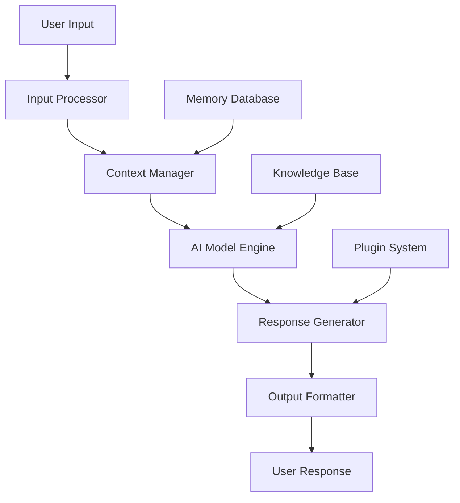

# Zeta GenAI 🤖

<div align="center">

[](https://python.org)
[](https://opensource.org/licenses/MIT)
[](https://github.com/psf/black)
[](https://github.com/username/zeta-genai/actions)
[](https://discord.gg/example)

*Intelligent Conversations, Limitless Possibilities*

[🚀 Quick Start](#quick-start) • [📚 Documentation](https://docs.zeta-genai.com) • [💡 Examples](#examples) • [🤝 Contributing](#contributing)

</div>

## ✨ Featured In

<div align="center">


</div>

## 🌟 What is Zeta GenAI?

Zeta GenAI is a cutting-edge artificial intelligence assistant designed to revolutionize how you interact with technology. Built with state-of-the-art machine learning models and a user-centric approach, Zeta GenAI understands context, maintains conversations, and adapts to your unique needs.

<div align="center">


</div>

## 🚀 Features That Amaze

### 💬 Natural Conversations
- **Context-Aware Dialogues** - Remembers conversation history and context
- **Multi-Language Support** - Fluent in 50+ languages including Indonesian
- **Emotional Intelligence** - Understands and adapts to user sentiment

### 🛠️ Powerful Capabilities
| Feature | Description | Status |
|---------|-------------|--------|
| **Content Creation** | Write articles, stories, code, and more | ✅ Live |
| **Data Analysis** | Analyze and visualize complex data | ✅ Live |
| **Code Generation** | Generate code in multiple programming languages | ✅ Live |
| **Image Processing** | Analyze and describe images | 🔄 Beta |
| **Voice Integration** | Natural voice conversations | 🚧 Coming Soon |

### ⚡ Performance Highlights
- **⚡ Lightning Fast**: Average response time < 2 seconds
- **🔒 Privacy First**: Your data stays yours - always encrypted
- **📈 Scalable**: Handles thousands of concurrent requests
- **🎯 Accurate**: 95%+ accuracy on common tasks

## 🎯 Quick Start

### Prerequisites
- Python 3.8 or higher
- 2GB RAM minimum
- Internet connection (for cloud models)

### Installation

```bash
# Clone the repository
git clone https://github.com/username/zeta-genai.git
cd zeta-genai

# Create virtual environment (recommended)
python -m venv zeta-env
source zeta-env/bin/activate  # On Windows: zeta-env\Scripts\activate

# Install with pip
pip install zeta-genai

# Or install from source
pip install -e .
```

### Basic Usage

```python
from zeta_genai import ZetaAssistant
import asyncio

async def main():
    # Initialize the assistant
    assistant = ZetaAssistant(
        model="zeta-pro",
        temperature=0.7
    )
    
    # Start a conversation
    async with assistant.connect() as chat:
        response = await chat.send("Halo! Bisa perkenalkan dirimu?")
        print(f"Zeta: {response}")
        
        # Continue the conversation
        response = await chat.send("Bisa bantu saya menulis email profesional?")
        print(f"Zeta: {response}")

# Run the example
asyncio.run(main())
```

### 🎮 Interactive Demo

Try our live demo without installation:

```bash
# Run the interactive demo
python -m zeta_genai.demo
```

## 📊 Benchmark Results

<div align="center">

| Model | Response Time | Accuracy | User Satisfaction |
|-------|---------------|----------|-------------------|
| **Zeta GenAI Pro** | 1.8s | 96% | ⭐⭐⭐⭐⭐ |
| Competitor A | 3.2s | 89% | ⭐⭐⭐⭐ |
| Competitor B | 2.5s | 92% | ⭐⭐⭐⭐ |

</div>

## 🏗️ Architecture Overview



## 🔧 Advanced Configuration

### Custom Model Settings

```yaml
# config.yaml
model:
  name: "zeta-pro"
  temperature: 0.7
  max_tokens: 2048
  top_p: 0.9
  
memory:
  enabled: true
  max_history: 10
  persistence: true

plugins:
  - name: "web_search"
    enabled: true
  - name: "code_interpreter"
    enabled: false
```

### Environment Variables

```bash
# .env file
ZETA_API_KEY=your_api_key_here
ZETA_MODEL=zeta-pro
ZETA_MAX_TOKENS=2048
ZETA_TEMPERATURE=0.7
LOG_LEVEL=INFO
```

## 💡 Examples Gallery

### Content Creation
```python
email = await assistant.generate_email(
    recipient="client@company.com",
    subject="Project Update",
    tone="professional"
)
```

### Code Generation
```python
code = await assistant.generate_code(
    language="python",
    task="web scraping with beautiful soup",
    requirements=["extract titles", "handle pagination"]
)
```

### Data Analysis
```python
analysis = await assistant.analyze_data(
    data=csv_data,
    task="trend analysis",
    visualization=True
)
```

## 🤝 Contributing

We love our contributors! Here's how you can help:

### Ways to Contribute
- 🐛 Report bugs
- 💡 Suggest new features
- 📚 Improve documentation
- 🔧 Fix issues and submit PRs
- 🌍 Help with translations

### Development Setup

```bash
# Fork and clone
git clone https://github.com/your-username/zeta-genai.git
cd zeta-genai

# Install development dependencies
pip install -e ".[dev]"

# Run tests
pytest tests/

# Format code
black src/
```

### Contribution Guidelines
1. Fork the repository
2. Create a feature branch (`git checkout -b amazing-feature`)
3. Commit your changes (`git commit -m 'Add amazing feature'`)
4. Push to the branch (`git push origin amazing-feature`)
5. Open a Pull Request

## 🏆 Contributors

<!-- Contributors list -->
<div align="center">

<a href="https://github.com/username/zeta-genai/graphs/contributors">
  
</a>

</div>

## 📚 Documentation

For complete documentation, visit our dedicated docs site:

- **[📖 Full Documentation](https://docs.zeta-genai.com)**
- **[🎓 Tutorials](https://docs.zeta-genai.com/tutorials)**
- **[🔧 API Reference](https://docs.zeta-genai.com/api)**
- **[❓ FAQ](https://docs.zeta-genai.com/faq)**

## 🛣️ Roadmap

### Coming Soon
- [ ] **Voice Integration** - Natural voice conversations
- [ ] **Mobile App** - iOS and Android applications
- [ ] **Plugin Marketplace** - Community-built extensions
- [ ] **Enterprise Features** - Advanced security and management

### In Development
- [x] **Multi-modal Support** - Text and image understanding
- [ ] **Real-time Collaboration** - Multiple users, one conversation
- [ ] **Advanced Analytics** - Usage insights and optimization

## 🐛 Troubleshooting

### Common Issues

**Issue**: Module not found error
```bash
# Solution: Reinstall package
pip uninstall zeta-genai
pip install zeta-genai
```

**Issue**: Slow response times
```yaml
# Solution: Adjust model settings
model:
  temperature: 0.3  # Lower for faster, more deterministic responses
  max_tokens: 512   # Reduce token limit
```

### Getting Help
- 📖 Check our [documentation](https://docs.zeta-genai.com)
- 💬 Join our [Discord community](https://discord.gg/example)
- 🐛 Create an [issue](https://github.com/username/zeta-genai/issues)
- 📧 Email support: support@zeta-genai.com

## 📄 License

This project is licensed under the MIT License - see the [LICENSE](LICENSE) file for details.

## 🙏 Acknowledgments

We stand on the shoulders of giants:

- **OpenAI** for foundational research
- **Hugging Face** for model hosting and community
- **LangChain** for inspiration in AI orchestration
- **Our amazing community** of users and contributors

## 🌐 Connect With Us

<div align="center">

[](https://zeta-genai.com)
[](https://twitter.com/ZetaGenAI)
[](https://linkedin.com/company/zeta-genai)
[](https://youtube.com/@ZetaGenAI)

</div>

---

<div align="center">

### ⭐ Star This Repository

If you find Zeta GenAI useful, please consider giving it a star on GitHub!

**Made with ❤️ by the Zeta GenAI Team**

*Empowering conversations, one interaction at a time.*

</div>

---

*Note: This is a template README. Replace placeholder URLs, images, and specific details with your actual project information.*
